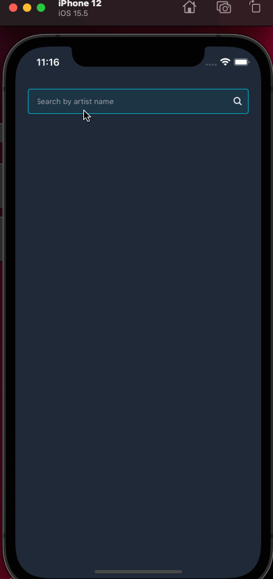

# Introduction

This is a music player app created using React Native and Expo.

The app uses iTunes api to request for songs by artists and display the top 25 results in a Flatlist.

# Key Technologies

- React Native [https://reactnative.dev/]
- Typescript [https://www.typescriptlang.org/]
- Expo [https://expo.dev/]
- Native Base [https://github.com/GeekyAnts/NativeBase]
- TanStack Query [https://tanstack.com/query/latest]
- Axios [https://axios-http.com/docs/intro]
- Jest [https://jestjs.io/]
- ESLint [https://eslint.org/]
- Prettier [https://prettier.io/]
- Mock service workers [https://mswjs.io/]V

# Instructions

1. Run `yarn` in root directory
2. Run `yarn start` to start up Expo
3. Press `a` for Android / `i` for iOS
